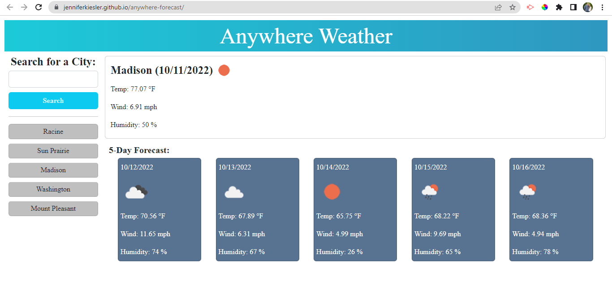

# Anywhere Forecast

## Description

This application is a weather dashboard that retrieves data from the OpenWeather API.

In this weather dashboard,
-   when a city is searched, the current weather condition and the 5 day forecast is displayed and that city is added to the search history.
-   in the current weather conditions for that city, the city name, the date, an icon representing the weather condition, the temperature, the wind speed, and the humidity is displayed.
-   in the 5 day forecast, the date, an icon representing the weather, the temperature, the wind speed, and the humidity is displayed.
-   if a city in the search history is clicked on, the current conditions and the 5 day forecast for that city is displayed.

This application would work great for someone just wanting to see the weather for the city that they are in or for a traveler who wants to see the weather outlook for the cities they are traveling too.

## Visuals

## Deployed Link

https://jenniferkiesler.github.io/anywhere-forecast/